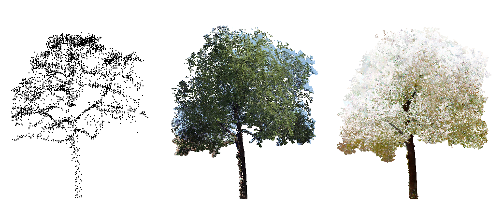
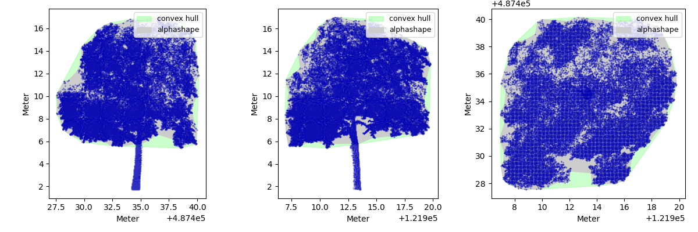

# PointCloud Tree Analysis

This repository contains methods for the **automatic extraction of various characteristics of trees in point clouds** using advanced analytical methods. The methods can serve as inspiration, or can be applied as-is under some specific assumptions:

1. Usage in The Netherlands (The "[Rijksdriehoek coordinate system](https://nl.wikipedia.org/wiki/Rijksdriehoeksco%C3%B6rdinaten)");
2. Point clouds in LAS format.

Example [notebooks](./pctm/notebooks) are provided to demonstrate the tools.



---

## Project Goal

The goal of this project is to automatically extract various features such as height, width, lowest branch, and other characteristics in point clouds. This information can be of value for tree health research and more. One of the main challenges in this project are overlapping trees, since it is difficult to distinguish in 3D point clouds which part belongs to which tree. Moreover, the sparsity and non-uniform density of typical point clouds makes robust methods difficult.

The first solution we provide is a pipeline that extracts various features from a **stand alone tree**. The input of this pipeline is a fully segmentated tree and produces a list of computed characteristics of the tree. These characteristics can be used for research or other purposes.

An example of a volume estimation for a given point cloud tree:


For a quick dive into this repository take a look at our [complete solution notebook](./pctm/notebooks/Complete%20Solution.ipynb).

---

## Folder Structure

 * [`datasets`](./dataset) _Demo dataset to get started_
   * [`ahn_surf`](./dataset/ahn_surf) _Example surface reference for tree point clouds_
   * [`ahn`](./dataset/ahn) _Example tree point clouds in AHN scan_
   * [`cyclo media`](./dataset/cyclo) _Example tree point clouds in Cyclo Media scan_
   * [`sonarski`](./dataset/sonarski) _Example tree point clouds in Sonarski scan_
 * [`media`](./imgs) _Visuals_
 * [`pctm`](./pctm/) _Python Library_
   * [`notebooks`](./pctm/notebooks) _Jupyter notebook tutorials_
   * [`scripts`](./pctm/scripts) _Python scripts_
   * [`src`](./pctm/src) _Python source code_
    * [`utils`](./pctm/src/utils) _Utility functions_

---

## Installation

This code has been tested with `Python >= 3.8` on `Linux` and `MacOS`, and should likely work under Windows as well.

1.  To use this code in development mode simply clone the repository and install the dependencies.

    ```bash
    # Clone the repository
    git clone https://github.com/Amsterdam-AI-Team/Urban_PointCloud_Processing.git

    # Install dependencies
    cd Urban_PointCloud_Processing
    python -m pip install -r requirements.txt
    ```

    or, with Conda:
    ```bash
    conda env create -f environment.yml
    ```

2.  Alternatively, the code can be installed as a Python package from source:

    ```bash
    # Install the latest release as Wheel
    python -m pip install https://github.com/Amsterdam-AI-Team/Urban_PointCloud_Processing/releases/download/v0.1/upcp-0.1-py3-none-any.whl

    # Alternatively, install the latest version from source
    python -m pip install git+https://github.com/Amsterdam-AI-Team/Urban_PointCloud_Processing.git#egg=upcp

    # Or, after making changes in the code
    cd Urban_PointCloud_Processing
    python -m pip install .
    ```

    If you use the latter and want your code changes to take effect without re-installing the package, use the `--editable` flag for pip.

---

## Usage

We provide tutorial [notebooks](./pctm/notebooks) that demonstrate how the tools can be used.

For visualisation of the resulting labelled point clouds we suggest [CloudCompare](https://www.danielgm.net/cc/). Simply open the labelled .laz in CloudCompare.

---

## Acknowledgements

This repository was created by [Falke Boskaljon](https://falke-boskaljon.nl/) for the City of Amsterdam.
